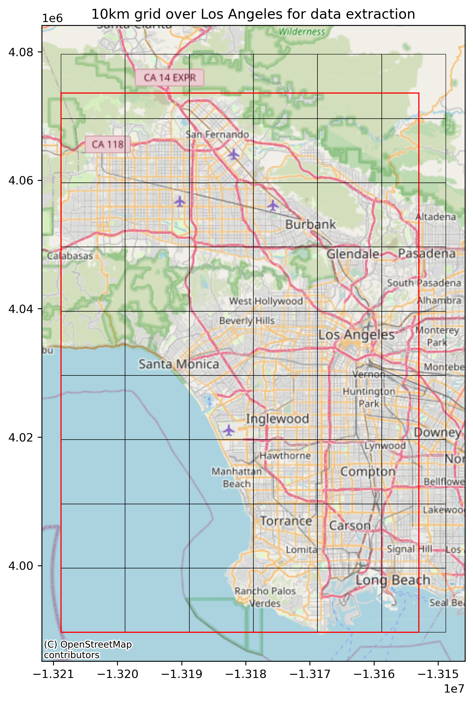

### Solar Energy Suitability Analysis  

#### Project Overview

This project explores the **suitability of commercial and industrial buildings in Los Angeles for rooftop solar energy deployment**.  
Using official City of Los Angeles geospatial datasets, the analysis identifies **large building footprints** that fall within 
**commercial and industrial zoning areas**, serving as a first screening for potential solar installations.

---

#### Objectives
- Identify **commercial and industrial zoning areas** within Los Angeles  
- Extract **building footprints** intersecting those zones  
- Filter buildings by **minimum rooftop size** suitable for solar installation  
- Produce a clean, reproducible geospatial dataset for further analysis and mapping  

---

#### Data Sources

#### 1. Building Footprints  
**Source:** Los Angeles GeoHub (ArcGIS REST API)  
**Layer:** Building Footprints (LARIAC5)

**Key attributes used:**
- Geometry (polygon footprints)  
- `AREA` (building footprint area)  

**Access method:**
- ArcGIS REST API queries with pagination using the requests python module 
- Geometry returned in WGS84 (EPSG:4326) and reprojected as needed  

---

#### 2. Zoning Data  
**Source:** data.lacity.org (Socrata / SODA API)

**Key attributes used:**
- `zone_category`  
- `zone_cmplt`  
- Geometry (zoning polygons)  

**Filtering criteria:**
- Commercial zones  
- Industrial zones
  
**Access method:**
- Socrata/SODA3 API query using the requests python module 
- Geometry returned in WGS84 (EPSG:4326) and reprojected as needed 
---

#### Methodology

#### Step 1: Zoning Filter
Zoning polygons were obtained from the **City of Los Angeles Open Data Portal** via the **Socrata API** (`data.lacity.org`).  

- The dataset contains polygons representing all zoning designations in the city.  
- Using GeoPandas and the Socrata API, we **filtered the dataset to retain only commercial and industrial categories**, forming the initial constraint layer for the analysis.  

  

#### Step 2: Building footprints. Test Extraction — DTLA Bounding Box  
Building footprints were queried from the **ArcGIS REST API** using a single, user-defined bounding box covering Downtown Los Angeles (DTLA). Footprints were retrieved using the API’s pagination method to handle large feature counts.

  

 
 
Extracted footprints were **filtered by area size** and **spatially intersected with commercial/industrial zoning polygons**, retaining only buildings with area >= 10,000 sq ft and located within these zones.

  

For this test case, the results are:
- **Total commercial/industrial buildings identified:** 5,913  
- **Buildings ≥ 10,000 sq ft:** 4,241 

#### Step 3: Automated Full Extraction  
We define our study area as the minimal bounding box of the union of all commercial/industrial zoning data polygons. To extract the data from ArcGIS API for the entire study area, an automated tiling approach was implemented:
- The study area was divided into **10 km × 10 km tiles**.
  

  
  
 
- Each tile was queried via the **ArcGIS REST API** using **size threshold filtering directly on the server** (footprints ≥ 10,000 sq ft / ~929 m²).  
- **Pagination** ensured that all features per tile were retrieved.  
- Extracted footprints were then **spatially joined with the zoning layer** to retain only buildings located within commercial/industrial zones.

**Results from the full tiling extraction:**

- **Total footprints retrieved from API (all tiles):** 717,604  
- **After spatial join with zoning:** 58,922 buildings  
- **Minimum area considered:** 10,000 sq ft (~929 m²)

#### Coordinate Reference Systems

- **Source CRS:** EPSG:4326 (WGS 84)  
- **Analysis / Mapping CRS:** EPSG:3857 (Web Mercator)  

Data were stored in **GeoPackage format** to preserve geometry fidelity and CRS information.

##### Next Steps
- **Extend the analysis to other cities** where detailed building footprint datasets may be limited or unavailable.  
- Explore **raster-based approaches** to identify building footprints, such as:  
  - **Object detection** on high-resolution aerial imagery or satellite data.  
  - Using indices similar to NDVI, such as the **Normalized Difference Built-up Index (NDBI)**, to detect rooftops or impervious surfaces suitable for solar potential estimation.
- Incorporate additional environmental or structural information, such as **sun exposure, rooftop shape, or slope**, to refine rooftop solar suitability, if such data is available.

